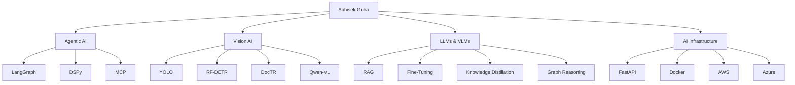
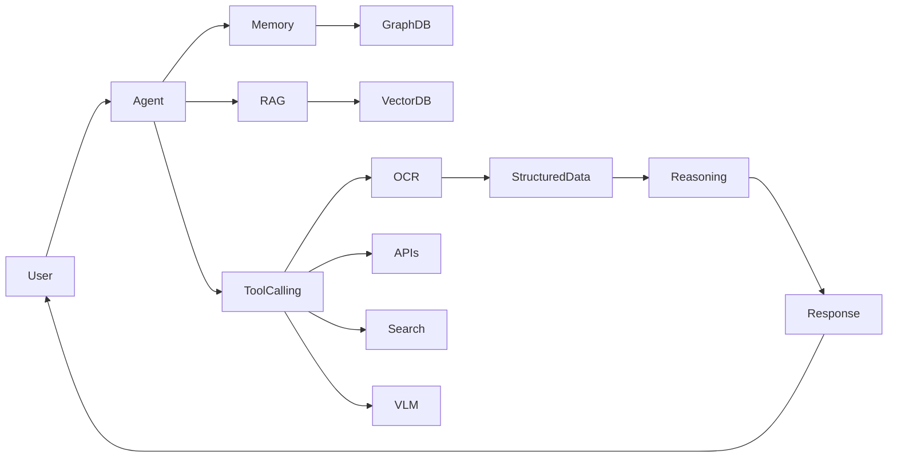

<div align="center">

# Abhisek Guha

### AI Engineer • Agentic AI Architect • Multimodal Systems Researcher

<p align="center">

</p>

<p align="center">
<a href="https://github.com/Abhisekguha">

</a>
</p>

</div>

---

# About Me

> *"The purpose of intelligence is not merely to know — but to act upon knowledge."*

In an era where machines are taught to answer questions, I focus on building systems that **reason, retrieve, perceive, and act**.

My work spans the complete AI lifecycle—from model training and fine-tuning to architecting production-grade multi-agent systems capable of autonomous decision making.

### Current Focus

🧠 Agentic AI & Multi-Agent Systems

👁️ Vision-Language Models (VLMs)

📄 OCR & Document Intelligence

🔍 Graph-RAG & Knowledge Retrieval

⚡ Production AI Infrastructure

🌐 Autonomous Browser Agents

---

# AI Capability Map



---

# Engineering Philosophy

```text
Observe → Understand → Retrieve → Reason → Act
```

I design AI systems that move beyond generation and become decision-capable systems capable of interacting with tools, memory, databases, APIs, and humans.

---

# Architecture Expertise



---

# Impact Dashboard

| Metric | Value |
|----------|----------|
| Documents Processed | 10,000+ |
| OCR Accuracy | 93.5% |
| Throughput Improvement | 3.4× |
| Token Reduction | 93% |
| Fine-Tuned Models | 15+ |
| AI Systems Built | 20+ |
| Browser Agents Developed | Multiple Production Deployments |
| Multi-Agent Systems | Production Ready |

---

# Core Expertise

| Domain | Mastery |
|----------|----------|
| Agentic AI | ████████████ 95% |
| Vision-Language Models | ████████████ 95% |
| OCR & Document AI | ████████████ 98% |
| Multi-Agent Systems | ███████████ 92% |
| Deep Learning | ███████████ 90% |
| Knowledge Retrieval | ███████████ 90% |
| MLOps & Deployment | ██████████ 85% |
| Frontend AI Applications | █████████ 80% |

---

# AI System Architecture Journey

```mermaid
graph TB

subgraph "2024 | Vision Intelligence"
A["👁️ Computer Vision Systems"]
A1["YOLOv8 / YOLOv10"]
A2["TensorFlow"]
A3["OpenCV"]
A4["Edge AI"]

A --> A1
A --> A2
A --> A3
A --> A4
end

subgraph "2025 | Document Intelligence"
B["📄 Document AI"]
B1["OCR Pipelines"]
B2["HTR Models"]
B3["Qwen2-VL"]
B4["Layout Detection"]
B5["Table Extraction"]

B --> B1
B --> B2
B --> B3
B --> B4
B --> B5
end

subgraph "2026 | Agentic AI Systems"
C["🤖 Autonomous AI Systems"]

C1["Multi-Agent Systems"]
C2["LangGraph"]
C3["DSPy"]
C4["MCP Servers"]
C5["Tool Calling"]
C6["Graph-RAG"]
C7["Browser Agents"]
C8["Memory Systems"]
C9["Reasoning Workflows"]

C --> C1
C --> C2
C --> C3
C --> C4
C --> C5
C --> C6
C --> C7
C --> C8
C --> C9
end

subgraph "Present | AI Systems Architect"
D["🚀 Production AI Ecosystem"]

D1["Agentic Workflows"]
D2["Vision-Language Models"]
D3["Autonomous Decision Systems"]
D4["Document Intelligence"]
D5["Knowledge Graphs"]
D6["Retrieval Systems"]
D7["API Infrastructure"]
D8["Cloud Deployment"]
D9["Human-in-the-Loop AI"]
D10["End-to-End AI Platforms"]

D --> D1
D --> D2
D --> D3
D --> D4
D --> D5
D --> D6
D --> D7
D --> D8
D --> D9
D --> D10
end

A --> B
B --> C
C --> D
```



---

# Featured Domains

## Agentic AI

- LangGraph Workflows
- DSPy Optimization
- Multi-Agent Collaboration
- MCP Integration
- Tool Calling Frameworks
- Memory-Augmented Agents

## Vision & Document Intelligence

- OCR Systems
- Handwritten Text Recognition
- Layout Detection
- Table Extraction
- Document Parsing
- Visual Question Answering

## Language & Reasoning

- Fine-Tuning LLMs
- Vision-Language Models
- Graph-RAG
- Knowledge Distillation
- Retrieval Systems
- Structured Reasoning

---

# Tech Stack

## AI & Machine Learning


## Agentic AI


## Vision AI


## Backend & Infrastructure


---

# Open Source & Research Interests

- Agentic AI
- Multi-Agent Systems
- Vision-Language Models
- OCR Research
- Graph-Based Reasoning
- Autonomous Web Agents
- Knowledge Distillation
- Retrieval-Augmented Generation
- Human-AI Collaboration

---

# GitHub Analytics

<div align="center">


</div>

---

# Achievements

🏆 AI/ML Engineer – Mondee Tech

🏆 Machine Learning Engineer – HyperWorks Imaging

🥈 2nd Place – INFED Data Analytics Hackathon (IIM Nagpur)

🏅 Smart India Hackathon Qualifier

🏅 Google H2S Hackathon Qualifier

🏅 Multiple Production AI Deployments

---

# Connect With Me

<p align="center">

<a href="mailto:abhisek.guha04@gmail.com">

</a>

<a href="https://linkedin.com/in/abhisek-guha-0565a5264">

</a>

<a href="https://github.com/Abhisekguha">

</a>

</p>

---

<div align="center">

### "Some build models. Some build products. I build intelligent systems."

</div>
