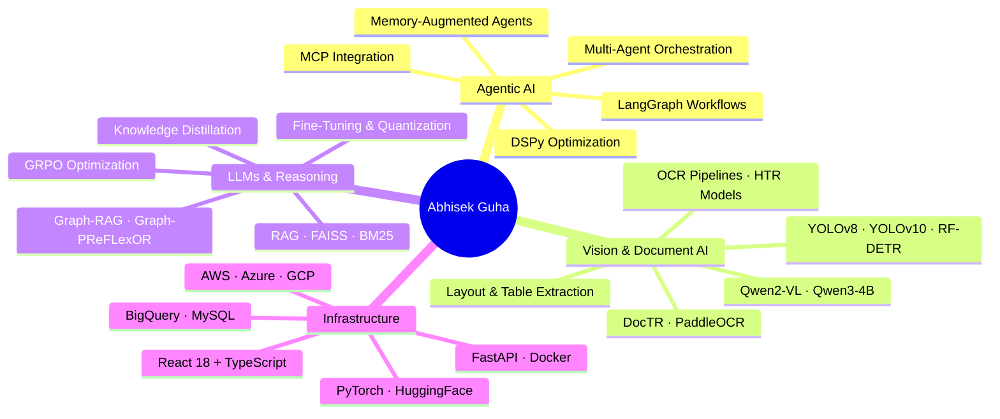

 

 

&nbsp;

&nbsp;

&nbsp;

---

## ⚡ Who I Build For

> *"Some build models. Some build products. I build **intelligent systems**."*

I'm an **AI/ML Engineer** specialising in end-to-end agentic AI systems — from fine-tuning frontier VLMs to architecting production-grade multi-agent pipelines. My work bridges cutting-edge research and real-world deployment across document intelligence, autonomous agents, and vision-language reasoning.

Currently building at **Mondee Tech** (Hyderabad), where I deploy LLM-powered workflows that process real financial data at scale.

---

## 🏢 Where I've Worked

| Company | Role | Period | Highlight |
|---|---|---|---|
| 🔵 **Mondee Tech** | AI/ML Engineer | Mar 2026 – Present | Deployed Qwen3-4B outperforming Gemini Pro by 35% |
| 🟣 **HyperWorks Imaging** | ML Engineer | Jan 2025 – Jan 2026 | 93.5% OCR accuracy across 10,000+ handwritten records |
| 🟢 **Aavaaz Inc.** | AI Research Intern | Dec 2024 – Jan 2025 | Multilingual ASR/STT/TTS pipelines for voice intelligence |
| 🟠 **NIT Raipur** | AI/ML Researcher | Aug 2024 – Nov 2024 | 94% accuracy on side-channel attack detection |
| 🔴 **Shoonya Technologies** | CV Engineer Intern | Jan 2024 – Jul 2024 | 85% precision in YOLOv8 recyclable detection |

---

## 🚀 Impact at a Glance

| 📄 Documents Processed | 🎯 OCR Accuracy | ⚡ Throughput Gain | 🧠 Token Reduction |
|:---:|:---:|:---:|:---:|
| **10,000+** | **93.5%** | **3.4×** | **93%** |

| 🤖 Models Fine-Tuned | 🏗️ AI Systems Built | 🌐 Browser Agents | 🥈 Hackathon Rank |
|:---:|:---:|:---:|:---:|
| **15+** | **20+** | **Production** | **2nd / IIM Nagpur** |

---

## 🧠 Core Competency Map

---

## 🏗️ Featured Projects

<b>🏥 Multi-Agent Medical AI System with MCP Integration</b> — Dec 2025

 

A production-grade multi-agent system for clinical reasoning and multimodal diagnosis.

- **VLM Core**: Llama 3.2 11B with 4-bit quantization on T4 GPU (10.5GB/15GB VRAM)
- **Retrieval**: FAISS-indexed CAG pipeline — 3,000+ chunks, hybrid BM25 + dense search; 3–9s clinical responses
- **Classification**: 83.54% Macro F1 on disease classification with human-in-the-loop via LangGraph confidence routing
- **MCP Server**: 4 specialised tools — Medical Image Analysis, Triage Assessment, Multimodal Diagnosis, Guideline Search
- **Triage Output**: Emergency / Urgent / Routine structured classification with async FastAPI UI

**Stack**: `Llama 3.2 VLM` `LangGraph` `FAISS` `MCP` `FastAPI` `4-bit Quantization`

<b>📄 Intelligent OCR Pipeline for Invoice Extraction</b> — Mondee Tech

 

A CPU-efficient document intelligence pipeline that eliminates wasteful LLM processing on low-quality inputs.

- **Pre-processing**: FastOCR quality scoring + YOLOv11s region detection via transfer learning
- **Token Efficiency**: 93% reduction in token consumption through adaptive image down-sampling
- **Frontend**: React 18 + TypeScript (Vite, Tailwind, TanStack Query) for seamless document ingestion
- **Domain**: Finance / Visa processing — structured extraction at production scale

**Stack**: `YOLOv11s` `FastOCR` `React 18` `TypeScript` `Gemini API` `FastAPI`

<b>🌐 GUI-Aware Browser Automation Agent</b> — HyperWorks Imaging

 

An autonomous browser agent that goes beyond rule-based scripting using vision-language understanding.

- **Vision**: OmniParser + RF-DETR for GUI element detection across arbitrary web interfaces
- **Memory**: DSPy RLM compression achieving 93% context reduction with 85% convergence
- **Capabilities**: Flight booking, e-commerce transactions, complex multi-step workflows
- **Validation**: Web-scraped data processed through DSPy to create contextual memory and execution signals

**Stack**: `OmniParser` `RF-DETR` `DSPy` `LangGraph` `Vision-Language Models`

<b>🔬 Handwritten Geological Record Digitisation</b> — HyperWorks Imaging

 

A production OCR platform digitising 10,000+ handwritten lithological records for geological data accessibility.

- **Accuracy**: 93.5% extraction accuracy across diverse handwritten formats
- **Stack**: PaddleOCR + ViT-HTR + Qwen2-VL — fine-tuned VLM-based OCR
- **Performance**: 3.4× throughput improvement; 85% improvement in data accessibility; 70% reduction in manual effort
- **Layout Intelligence**: YOLOv10 + RF-DETR for layout detection, rotation-aware parsing, coordinate-based cell normalisation

**Stack**: `Qwen2-VL` `PaddleOCR` `ViT-HTR` `YOLOv10` `RF-DETR` `DocTR`

<b>🔐 AI-Driven Side-Channel Attack Detection</b> — NIT Raipur

 

Research-grade ML system for hardware security against adversarial power-analysis attacks.

- **Target**: AES-128 encryption on Sakura-G board
- **Accuracy**: 94% classification accuracy — 25% gain over baseline Differential Power Analysis
- **Security**: 40% improvement in system resistance to AI-based adversarial attacks via cryptographic countermeasures
- **Architecture**: Modernised CNN and MLP architectures on power-trace voltage datasets

**Stack**: `PyTorch` `CNNs` `MLPs` `MySQL` `Power-Trace Analysis`

---

## 🛠️ Tech Stack

### AI & Machine Learning

### Agentic AI & LLMs

### Computer Vision & OCR

### Backend & Infrastructure

### Frontend

### Languages & Data

---

## 📊 GitHub Analytics

  
  &nbsp;
  

  

---

## 🏆 Recognition

| 🥈 | **2nd Place** — INFED Data Analytics Hackathon, **IIM Nagpur** | Nov 2024 |
|:---:|:---|:---|
| 🏅 | **Qualifier** — Smart India Hackathon (SIH) | Oct 2024 |
| 🏅 | **Qualifier** — Google H2S Hackathon (Hack2Skill) | May 2024 |
| 🎓 | **Generative AI with LLMs** — Coursera | May 2024 |
| ☁️ | **Google Cloud Computing** — Google Developers Group | Aug 2023 |
| 📊 | **Supervised Machine Learning** — Coursera | Jul 2023 |

---

## 🎓 Education

**B.Tech — Computer Science & Engineering (Artificial Intelligence)**
Chhattisgarh Swami Vivekananda Technical University, Bhilai · Oct 2022 – Jun 2026 · CGPA: **7.5**

---

## 🔭 Research Interests

`Agentic AI` &nbsp;·&nbsp; `Multi-Agent Systems` &nbsp;·&nbsp; `Vision-Language Models` &nbsp;·&nbsp; `Graph-RAG`
`Document Intelligence` &nbsp;·&nbsp; `Browser Agents` &nbsp;·&nbsp; `Knowledge Distillation` &nbsp;·&nbsp; `Human-AI Collaboration`
`OCR & HTR` &nbsp;·&nbsp; `Autonomous Decision Systems` &nbsp;·&nbsp; `Retrieval-Augmented Generation`

---

